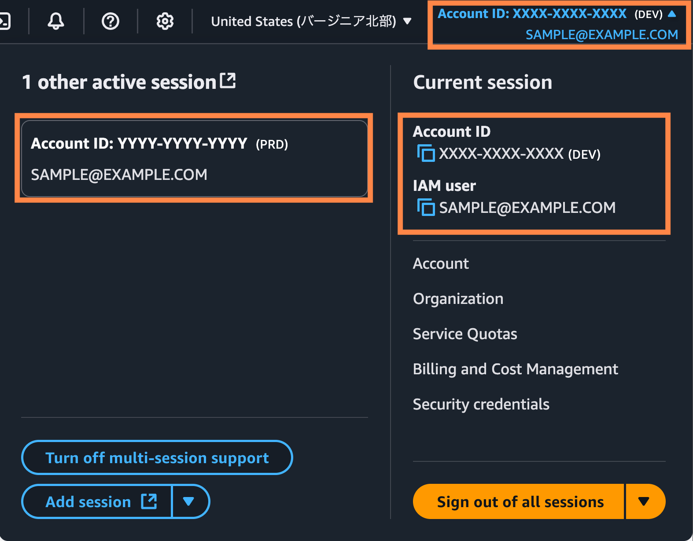

# AWS Multi-Session Custom Alias Chrome Extension

AWS マルチセッション機能で、アカウント ID に個人用のカスタムエイリアスを設定・表示する Chrome 拡張機能です。

## 概要

この拡張機能を使用すると、AWS コンソールで表示されるアカウント ID（例：`1234-5678-9012`）に、分かりやすいエイリアス（例：`本番環境`）を追加表示できます。

## 主な機能

- **カスタムエイリアス**: アカウント ID に個人用の名前を設定
- **スマート表示**: ナビゲーション部分では全ページ、コンテンツ部分は home ページのみ
- **安全な除外**: ARN やリソース ID などには影響しない
- **データ管理**: 設定のインポート/エクスポート機能

## インストール

1. [Chrome 拡張機能ページ](chrome://extensions/) を開く
2. 「開発者モード」をオンにする
3. 「パッケージ化されていない拡張機能を読み込む」をクリック
4. このフォルダを選択

## 使い方

1. **エイリアス設定**: 拡張機能アイコンをクリックしてアカウント ID とエイリアス名を入力
2. **表示確認**: AWS コンソール（マルチセッション URL）でエイリアスが表示されることを確認

### 対応 URL

- マルチセッション URL: `https://<accountid>-xxx.<region>.console.aws.amazon.com/`

## 技術仕様

- **対応ブラウザ**: Google Chrome (Manifest V3)
- **権限**: ローカルストレージ、AWS コンソールでの動作のみ
- **データ保存**: ブラウザのローカルストレージのみ（外部送信なし）

## ライセンス

MIT License

## 更新履歴

### v1.0.0 (2025-08-05) - 正式版リリース

#### 🎯 **コア機能**

- **スマートな表示制御**: ナビゲーション部分では全ページ、コンテンツ部分は console/home のみで表示
- **完全な形式対応**: 12 桁形式・ハイフン区切り形式の両方に対応
- **リアルタイム更新**: MutationObserver による動的コンテンツの監視と即座のエイリアス適用

#### 🔧 **技術実装**

- **Chrome Manifest V3** 対応の Service Worker ベース実装
- **インテリジェントな除外機能**: ARN、リソース ID、コードブロック内のアカウント ID を自動除外
- **重複防止機構**: エイリアスの重複表示を完全に防止
- **パフォーマンス最適化**: デバウンス制御による効率的な DOM 処理

#### 🎨 **UI/UX**

- **直感的な設定画面**: ポップアップでの簡単なエイリアス管理
- **ダークモード対応**: エイリアスを白色で統一表示し、すべてのテーマで視認性を確保
- **JSON インポート/エクスポート**: 設定のバックアップと移行機能

#### 🔒 **セキュリティ**

- **最小権限の原則**: 必要最小限の権限のみで動作
- **ローカルストレージ**: すべてのデータはブラウザ内でのみ保存
- **コンテキストメニュー**: AWS コンソール上で右クリックから設定画面へアクセス可能
